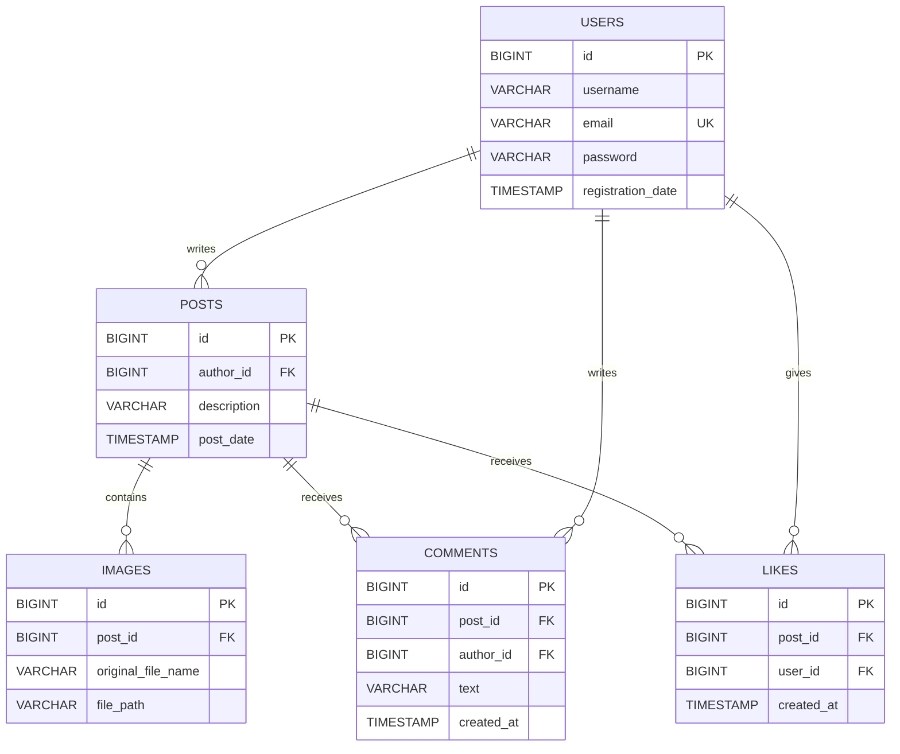

**CatsGram** - это социальная сеть для обмена фотографиями и мыслями.

---

##  Стек 

### Frontend
- **React** + Vite
- **React Router DOM** (Для маршрутизации)
- **Chart.js** (Визуализация дашбордов)
- **Context API**
- **CSS + HTML**

### Backend
- **Java 21**
- **Spring Boot** (Web, Security, Data JPA)
- **Spring Security + JWT**
- **PostgreSQL**
- **JDBC / JPA** (Работа с данными)

---

##  Front

### Аутентификация
- Регистрация с валидацией данных и хешированием паролей.
- Разделение доступа на публичные и приватные маршруты (Protected Routes).

### Управление постами
- Создание текстовых постов и загрузка изображений.
- Просмотр ленты (Feed) с бесконечным скроллом (пагинация).
- Редактирование и удаление своих постов.


###  Взаимодействие
- Система **Лайков**
- **Комментирование**
- Отдельный роут для страницы поста

###  Профили
- Персональная страница пользователя со статистикой.
- Просмотр профилей других пользователей.
- Сортировка постов по дате и популярности.

### Дашборд
- Аналитика роста пользователей и постов (через Chart.js).
- Статистика за день, месяц и год.
- Контроль подключения к серверу. (через fetch)

---

## Back

### Архитектура

- `controller` — REST API endpoints and request validation.
- `service` — business logic, checks, and orchestration.
- `dao` — JPA repositories.
- `entity` — database entities.
- `dto` — API request/response models.
- `mapper` — entity-to-DTO mapping.
- `exception` — custom exceptions and centralized error handling.


### API overview

Users:
- `GET /users` — получить юзеров.
- `GET /users/{userId}` — получить юзера по ID.
- `GET /users/{userId}/posts` — получить посты по юзеру.
- `POST /users` — создать юзера.
- `PUT /users` — обновить юзера.

Posts:
- `GET /posts` — получить посты с пагинацией (`from`, `size`, `sort`).
- `GET /posts/{postId}` — пост по ID.
- `POST /posts` — создать пост.
- `PUT /posts` — обновить пост.
- `GET /posts/{postId}/images` — получить изображение поста.

Images:
- `POST /posts/{postId}/images` — загрузить изображение.
- `GET /images/{imageId}` — скачать изображение.

Likes:
- `POST /posts/{postId}/likes` — добавить лайк (body: `userId`).
- `GET /posts/{postId}/likes` — получить лайки по посту.
- `DELETE /posts/{postId}/likes/{userId}` — убрать лайк.

Comments:
- `POST /posts/{postId}/comments` — добавить комментарий (body: `authorId`, `text`).
- `GET /posts/{postId}/comments` — получить комментарии.


---

## Схема базы данных (ER-диаграмма)

Ниже представлена структура базы данных, отображающая связи между сущностями:


---
## Запуск

Запуск бека (из папки back)

```bash
mvn spring-boot:run
```

Запуск фронта (из папки front)

```bash
npm install
npm run dev
```
