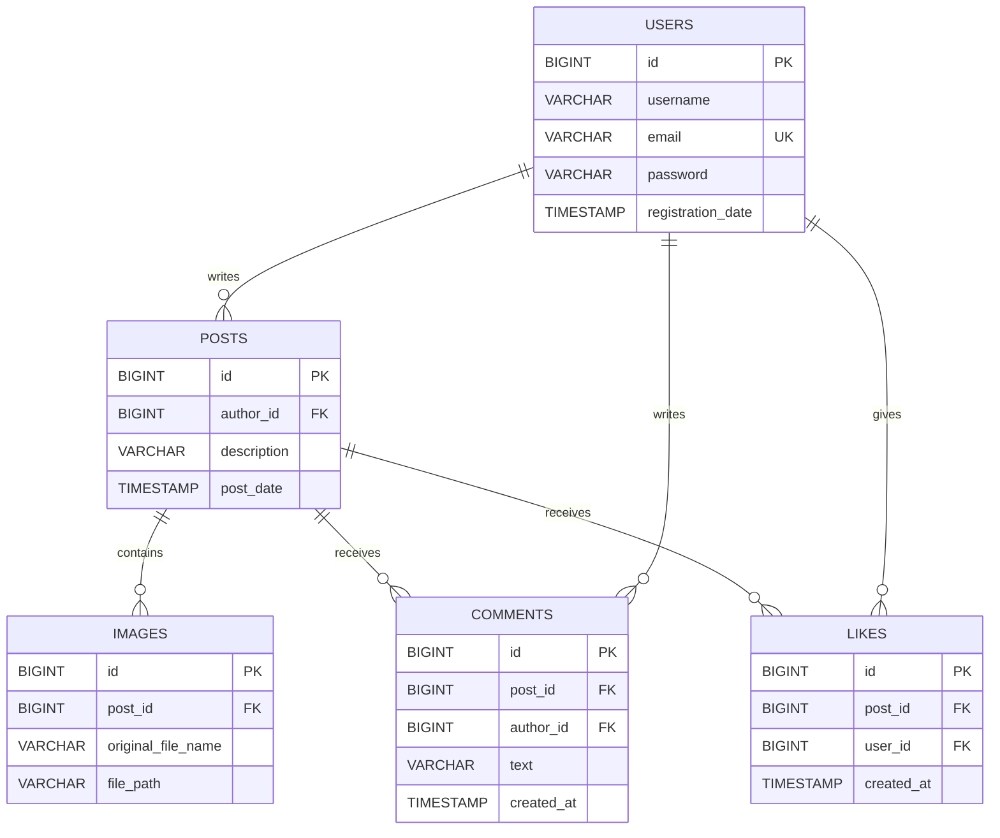

# 🐾 CatsGram

**CatsGram** — это социальная сеть для обмена фотографиями и мыслями. Платформа позволяет пользователям регистрироваться, публиковать посты с изображениями, комментировать записи других пользователей, ставить лайки и следить за активностью сообщества через аналитический дашборд.

Проект разработан с использованием **React** для фронтенда и **Spring Boot** для бэкенда.

---

## 🛠 Стек технологий

### Frontend
- **React 18** + Vite
- **React Router DOM** (Маршрутизация)
- **Chart.js** (Визуализация аналитики)
- **Context API** (Управление состоянием и темами)
- **CSS3** (Кастомные стили)

### Backend
- **Java 17+**
- **Spring Boot** (Web, Security, Data JPA)
- **Spring Security + JWT** (Аутентификация и авторизация)
- **PostgreSQL** (Реляционная база данных)
- **JDBC / JPA** (Работа с данными)

---

## ✨ Функционал

### 🔐 Аутентификация
- Регистрация с валидацией данных и хешированием паролей.
- Вход в систему с использованием **JWT (JSON Web Tokens)**.
- Разделение доступа на публичные и приватные маршруты (Protected Routes).
- Безопасный выход из аккаунта (Logout).

### 📝 Управление постами
- Создание текстовых постов и загрузка изображений.
- Просмотр ленты (Feed) с бесконечным скроллом.
- Редактирование и удаление своих постов.
- Копирование ссылки на пост в буфер обмена.

###  Взаимодействие
- Система **Лайков** с оптимистичным обновлением интерфейса.
- **Комментирование** постов с поддержкой эмодзи.
- Удаление комментариев (доступно автору комментария или автору поста).

### 👤 Профили
- Персональная страница пользователя со статистикой.
- Просмотр профилей других пользователей.
- Сортировка постов по дате и популярности.

### 📊 Административный дашборд
- Аналитика роста пользователей и постов (Графики Chart.js).
- Статистика за день, месяц и год.
- Контроль подключения к серверу в реальном времени.

---

## 🗄️ Схема базы данных (ER-диаграмма)

Ниже представлена структура базы данных, отображающая связи между сущностями:

